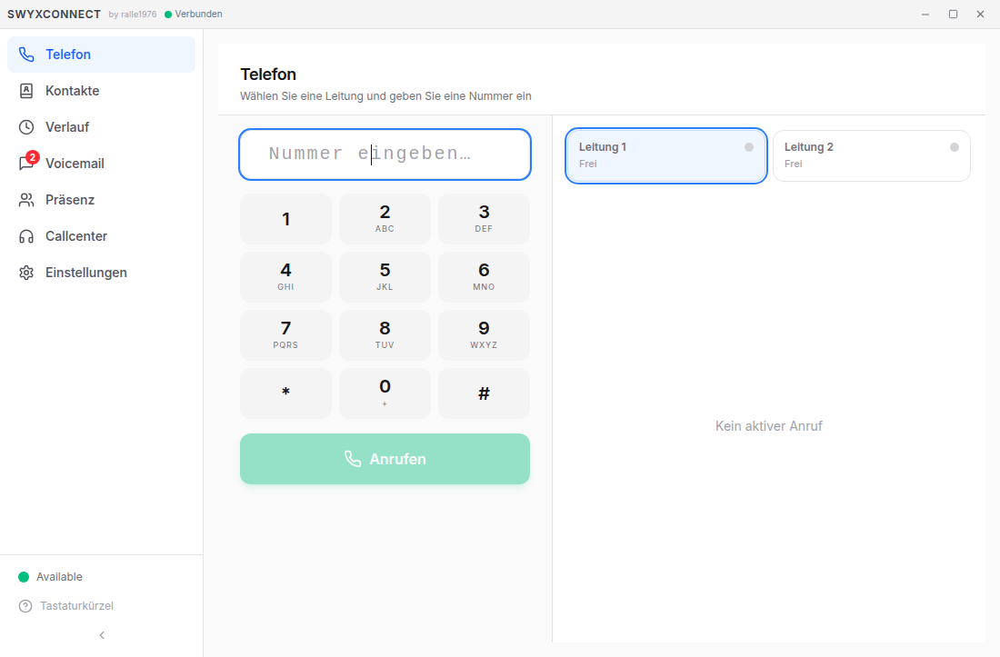
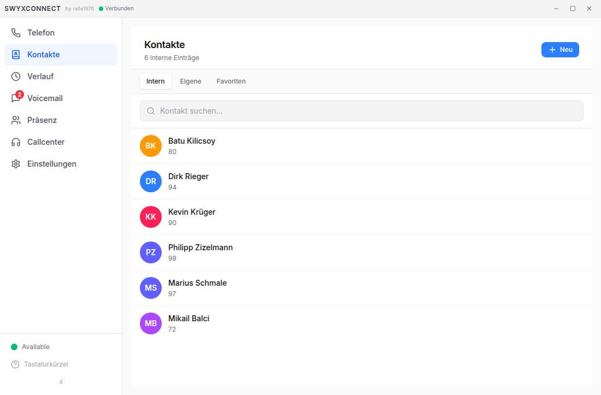
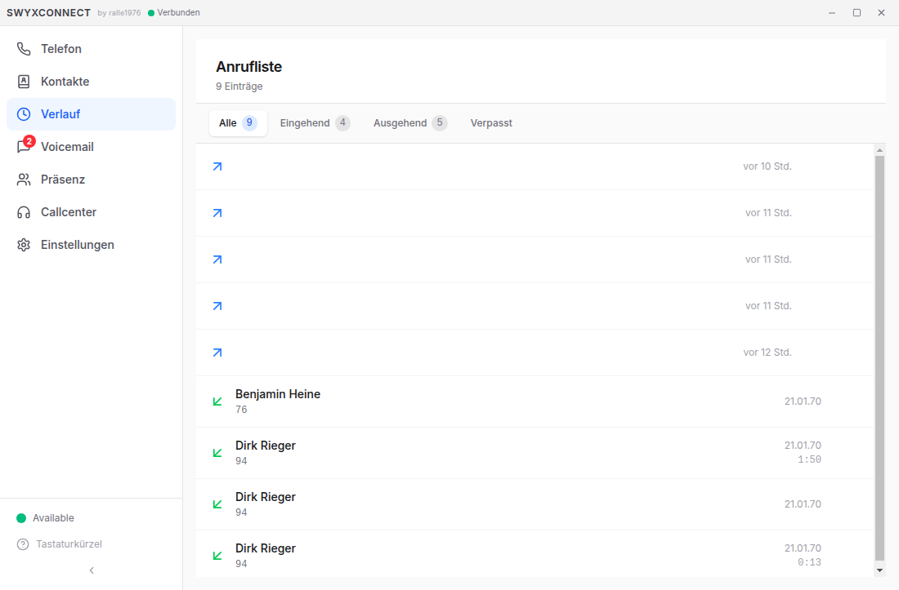
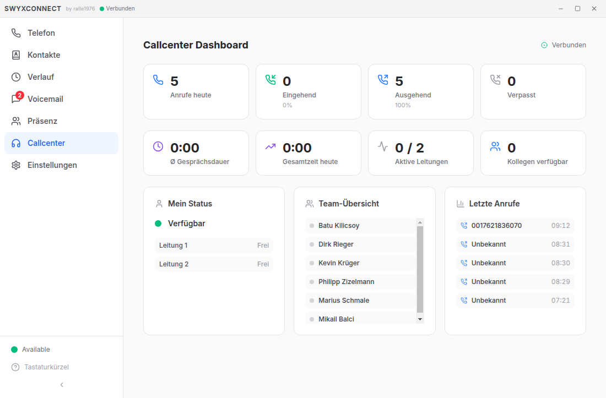
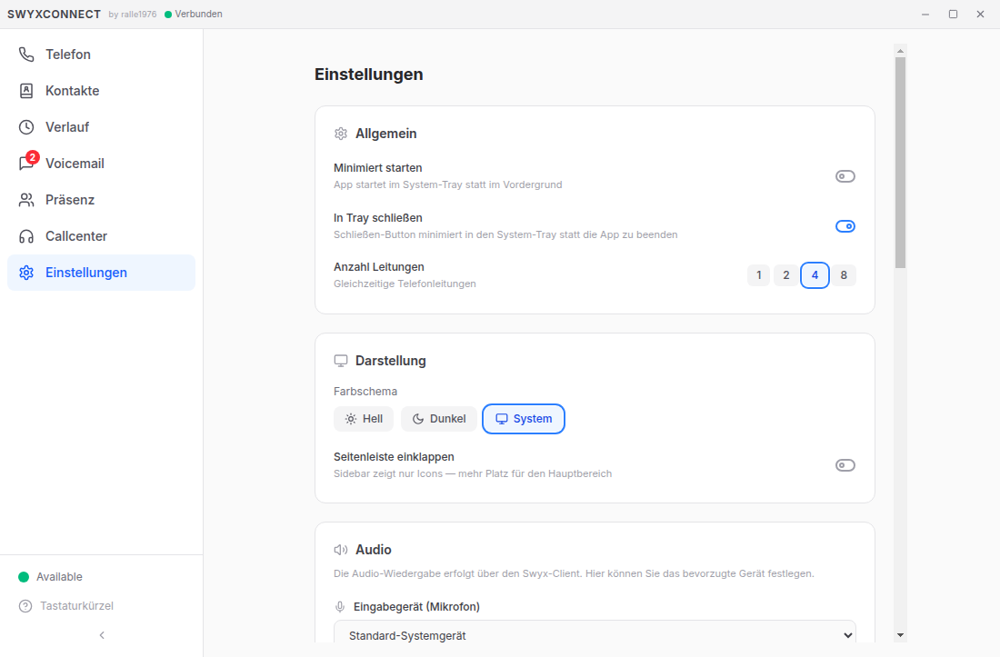
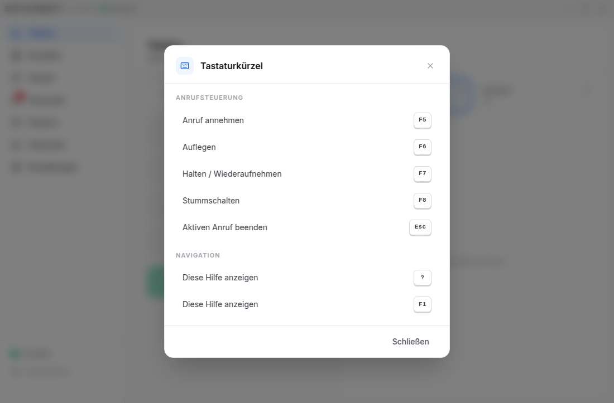

# SwyxConnect

**Moderner Desktop-Softphone-Client für Swyx/Enreach**

SwyxConnect ist ein modernes UI-Replacement für SwyxIt!. Die Anwendung bietet eine intuitive, reaktive Oberfläche für Telefonie, Präsenzverwaltung und Callcenter-Funktionen — optimiert für den täglichen Einsatz in Büro und Callcenter.

---

## Features

**Telefonie**
- Anrufen, Annehmen, Auflegen über visuelles Dialpad
- Halten, Weiterleiten und Makeln
- DTMF-Tastentöne während des Gesprächs
- 4 Leitungen mit Echtzeit-Statusanzeige
- Eingehende Anrufe mit Popup-Banner
- Tastaturkürzel: F5 Annehmen, F6 Auflegen, F7 Halten, F8 Stumm, Esc Beenden
- Integrierte Tastenkürzel-Hilfe (F1 oder ?)

**Kontakte & Verlauf**
- Firmen-Kontaktbuch mit Schnellsuche (Echtdaten vom Swyx-Server)
- Kontaktdetails mit Direktwahl
- Vollständiger Anrufverlauf mit Richtungsfilter
- Verpasste Anrufe auf einen Blick

**Voicemail**
- Übersicht aller Sprachnachrichten
- Neue Nachrichten hervorgehoben
- Wiedergabe und Verwaltung

**Präsenz**
- Eigener Status: Verfügbar, Beschäftigt, Abwesend, Nicht stören
- Echtzeit-Präsenz aller Kollegen
- Bidirektionale Synchronisierung mit Microsoft Teams

**Callcenter**
- Agent-Dashboard mit Warteschlangen-Übersicht
- Supervisor-Ansicht mit Statistiken
- Echtzeit-Auslastungsanzeige

**Benutzeroberfläche**
- Helles und dunkles Farbschema (automatisch oder manuell)
- Klappbare Sidebar mit Badge-Zählern
- Custom Titlebar mit Verbindungsstatus
- System-Tray-Integration
- Vollständig deutsche Benutzeroberfläche

---

## Screenshots

### Telefon — Dialpad mit Leitungsanzeige


### Kontakte — Firmen-Kontaktbuch mit Echtzeitdaten


### Anrufliste — Verlauf mit Richtungsfilter


### Callcenter — Dashboard mit KPIs und Team-Übersicht


### Einstellungen — Theme, Audio, Telefonie, Teams


### Tastaturkürzel — Übersicht aller Hotkeys (F1)


---

## Systemanforderungen

| Anforderung | Details |
|---|---|
| **Betriebssystem** | Windows 10/11 (x86/x64) |
| **Swyx-Server** | SwyxWare / Enreach On-Premises (v14.x) |
| **Swyx-Client** | SwyxIt! 14.x **oder** CLMgr Standalone (siehe unten) |
| **.NET Runtime** | .NET 8 (x86) |
| **Optional** | Microsoft Teams (für Präsenz-Sync) |

---

## Installation

SwyxConnect benötigt Zugriff auf den Swyx CLMgr COM-Server. Dafür gibt es zwei Wege:

### Variante A: Mit SwyxIt! (empfohlen)

Die einfachste Variante — SwyxIt! ist bereits installiert und angemeldet.

1. SwyxIt! installieren und am Swyx-Server anmelden
2. SwyxConnect starten — verbindet sich automatisch mit dem laufenden CLMgr

> SwyxIt! muss installiert sein, aber nicht im Vordergrund laufen. CLMgr.exe startet automatisch im Hintergrund.

### Variante B: CLMgr Standalone (ohne SwyxIt!)

Für Umgebungen ohne vollständige SwyxIt!-Installation. CLMgr-Dateien werden aus einer vorhandenen SwyxIt!-Installation kopiert und als COM-Server registriert.

**Voraussetzung:** Zugriff auf eine SwyxIt!-Installation (lokal oder im Netzwerk) als Quelle für die CLMgr-Dateien.

```powershell
# Automatisches Setup (als Administrator)
.\scripts\setup-clmgr.ps1

# Oder mit explizitem Quellpfad
.\scripts\setup-clmgr.ps1 -SourcePath "\\server\share\SwyxIt!"

# Deinstallation
.\scripts\setup-clmgr.ps1 -Uninstall
```

Alternativ kann die COM-Registrierung manuell über die Registry-Dateien erfolgen:

```
scripts\register-clmgr.reg    → COM registrieren (als Admin ausführen)
scripts\unregister-clmgr.reg  → COM entfernen
```

> **Hinweis:** CLMgr.exe und zugehörige DLLs sind proprietäre Swyx/Enreach-Dateien und werden nicht mit SwyxConnect ausgeliefert.

### Diagnose

```powershell
# Prüft CLMgr, COM-Registrierung, Ports und .NET Runtime
.\scripts\check-clmgr.ps1
```

---

### Aus Releases (empfohlen)

1. Neuestes Release von [GitHub Releases](https://github.com/Ralle1976/SwyxConnect/releases) herunterladen
2. Installer ausführen
3. SwyxConnect starten — verbindet sich automatisch

### Aus Quellcode

```bash
git clone https://github.com/Ralle1976/SwyxConnect.git
cd SwyxConnect
npm install
```

**C# Bridge bauen:**

```bash
# .NET 8 SDK erforderlich
dotnet publish bridge/SwyxBridge/SwyxBridge.csproj -c Release -r win-x86 --self-contained false -o out/bridge
```

**Entwicklungsmodus:**

```bash
npm run dev
```

**Produktions-Build:**

```bash
npx electron-vite build
npm run build:win
```

---

## Technologie

| Komponente | Technologie |
|---|---|
| Desktop-Anwendung | Electron 35 |
| Benutzeroberfläche | React 19, TypeScript, Tailwind CSS v4 |
| Swyx-Anbindung | C# COM Bridge (.NET 8, x86) |
| State Management | Zustand |
| Build-System | electron-vite |
| IPC-Protokoll | JSON-RPC 2.0 über stdin/stdout |
| Installer | electron-builder (NSIS) |

### Architektur

```
┌─────────────────────────────────────────────────┐
│               Electron App                      │
│  ┌───────────┐  ┌──────────┐  ┌──────────────┐ │
│  │   Main    │  │ Preload  │  │   Renderer   │ │
│  │ Process   │◄─┤  Bridge  ├─►│ React + TS   │ │
│  │ (IPC Hub) │  │          │  │ Tailwind v4  │ │
│  └─────┬─────┘  └──────────┘  └──────────────┘ │
│        │ stdin/stdout (JSON-RPC 2.0)            │
│  ┌─────▼─────────────────────────────────────┐  │
│  │  SwyxBridge.exe  (.NET 8, x86)            │  │
│  │  COM Interop → CLMgr → SwyxWare           │  │
│  └───────────────────────────────────────────┘  │
└─────────────────────────────────────────────────┘
```

---

## Scripts

| Script | Beschreibung |
|---|---|
| `scripts/setup-clmgr.ps1` | CLMgr Standalone-Setup (kopiert Dateien + registriert COM) |
| `scripts/check-clmgr.ps1` | Diagnose: CLMgr, COM, Ports, .NET Runtime |
| `scripts/register-clmgr.reg` | Manuelle COM-Registrierung via Registry |
| `scripts/unregister-clmgr.reg` | COM-Registrierung entfernen |
| `scripts/build-bridge.ps1` | C# Bridge bauen und deployen |
| `scripts/test-bridge.mjs` | Bridge-Verbindungstest (JSON-RPC) |

---

## Dokumentation

Die vollständige Dokumentation befindet sich im [Wiki](https://github.com/Ralle1976/SwyxConnect/wiki):

- [Funktionsübersicht](https://github.com/Ralle1976/SwyxConnect/wiki/Home) — Alle Features im Detail
- [Installation](https://github.com/Ralle1976/SwyxConnect/wiki/Installation) — Einrichtung Schritt für Schritt
- [Telefonie](https://github.com/Ralle1976/SwyxConnect/wiki/Telefonie) — Anrufe, Leitungen, Weiterleitung
- [Kontakte & Verlauf](https://github.com/Ralle1976/SwyxConnect/wiki/Kontakte-und-Verlauf) — Kontaktbuch, Anrufhistorie
- [Präsenz & Teams](https://github.com/Ralle1976/SwyxConnect/wiki/Praesenz) — Status, Kollegen, Teams-Sync
- [Callcenter](https://github.com/Ralle1976/SwyxConnect/wiki/Callcenter) — Dashboard, Warteschlangen
- [Einstellungen](https://github.com/Ralle1976/SwyxConnect/wiki/Einstellungen) — Theme, Konfiguration
- [Entwicklung](https://github.com/Ralle1976/SwyxConnect/wiki/Entwicklung) — Setup, Build, Architektur

---

## Lizenz

Proprietär — Alle Rechte vorbehalten.

---

## Autor

**Ralle1976** — [GitHub](https://github.com/Ralle1976)
